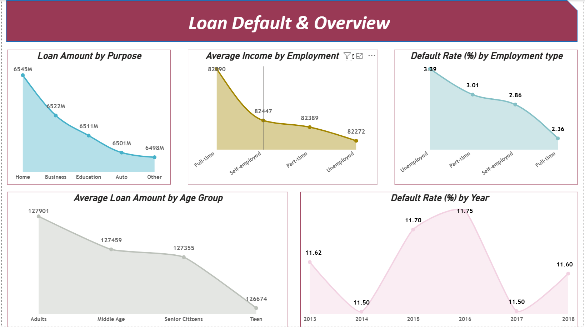
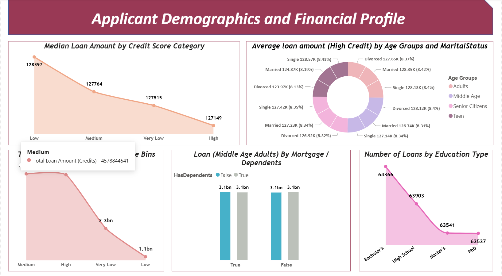
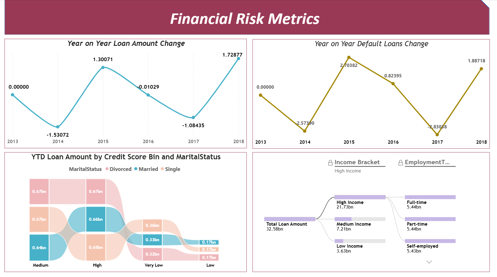
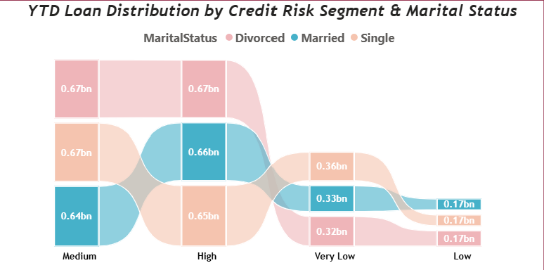
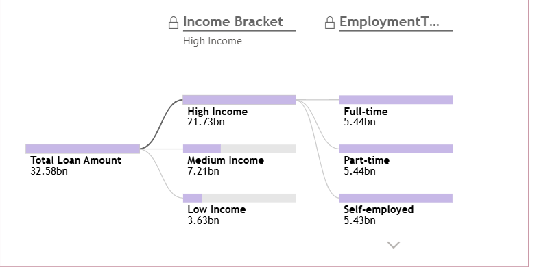

# 📊 Loan Risk Analytics Dashboard (255K+ Records)

## 📌 Project Overview

This project delivers a comprehensive **Financial Risk & Loan Portfolio Analytics Dashboard** built using **MSSQL and Power BI** on a dataset of over **255,000 loan records**.

The solution analyzes:

- Credit risk segmentation
- Loan default behavior
- Applicant demographic patterns
- Income & employment-based risk drivers
- Year-over-Year (YoY) and Year-to-Date (YTD) performance trends

The objective is to enable **data-driven credit decision-making** through advanced DAX modeling and interactive analytics.

---

# 🛠 Technology Stack

- **MSSQL** – Data storage & SQL transformations
- **Power BI** – Data modeling & dashboard development
- **DAX** – Advanced measures & filter context control
- **Time Intelligence** – YTD & YoY analysis
- **Decomposition Tree** – Root-cause driver analysis

---

# 📊 Dashboard Pages & Visual Analysis

---

# 🔹 1. Loan Default & Overview

### Key Visuals Included:

- **Loan Amount by Purpose** (Home, Business, Education, Auto, Other)
- **Average Income by Employment Type**
- **Default Rate (%) by Employment Type**
- **Average Loan Amount by Age Group**
- **Default Rate (%) by Year**

### Key Insights:

- Employment type influences both income levels and default probability.
- Unemployed segments show higher default risk.
- Teen applicants show lower average loan values.
- Default rates fluctuate across years, highlighting portfolio volatility.

This page provides a macro-level view of loan performance and portfolio risk.

---

# 🔹 2. Applicant Demographics & Financial Profile

### Key Visuals Included:

- **Median Loan Amount by Credit Score Category**
- **Average Loan Amount (High Credit) by Age Group & Marital Status**
- **Total Loan (Adults) by Credit Score Bins**
- **Loan (Middle Age Adults) by Mortgage / Dependents**
- **Number of Loans by Education Type**

### Key Insights:

- Lower credit score bins tend to have higher median loan fluctuations.
- Education level impacts loan distribution volume.
- Dependents and mortgage status influence loan allocation.
- Age segmentation reveals distinct borrowing patterns.

This page focuses on borrower profiling and demographic-based risk segmentation.

---

# 🔹 3. Financial Risk Metrics (Time Intelligence)

### Key Visuals Included:

- **Year-on-Year Loan Amount Change**
- **Year-on-Year Default Loans Change**
- **YTD Loan Amount by Credit Score Bin & Marital Status (Ribbon Chart)**

### Advanced Analysis Implemented:

- YTD Loan Amount using `DATESYTD`
- YoY Loan Amount Change using time-based comparison logic
- YoY Default Loan Change
- Advanced filter context management using `CALCULATE`, `ALLEXCEPT`, and `FILTER`

### Key Insights:

- Loan growth and default growth do not move uniformly.
- Certain years show rising default acceleration.
- YTD distribution highlights risk concentration across marital segments and credit tiers.

This page demonstrates advanced time intelligence modeling and portfolio risk tracking.

---

---

# 🔹 4. YTD Loan Distribution by Credit Risk Segment & Marital Status (Ribbon Chart)

### What This Visual Shows:

- Year-To-Date loan distribution across:
  - Credit Risk Segments (Low, Very Low, Medium, High)
  - Marital Status (Single, Married, Divorced)

### Analytical Purpose:

- Identifies concentration of loan exposure across risk tiers
- Highlights marital-status-based credit distribution shifts
- Tracks how dominant borrower segments change across credit bands

### Key Insight:

Medium and High credit segments contribute significantly to total exposure, while Low and Very Low segments show reduced volume but require risk monitoring.

---

# 🔹 5. Decomposition Tree – Driver Analysis

### Root Cause Analysis Performed:

- Total Loan Amount breakdown by:
  - Income Bracket (High / Medium / Low)
  - Employment Type (Full-time / Part-time / Self-employed)

### What This Enables:

- Identification of dominant income segments
- Drill-down exploration of employment contribution
- Dynamic root-cause driver investigation

This visual showcases analytical maturity beyond basic dashboarding.

---

# 📊 Data Model & DAX Implementation

### Model Design:

- Single flat fact table (255K+ rows)
- Calculated columns:
  - Year
  - Age Groups
  - Credit Score Bins
  - Income Bracket
- Dedicated measure tables:
  - Overview Measures
  - Financial Risk Measures
  - Applicant Demographic Measures

### Advanced DAX Used:

- `CALCULATE`
- `FILTER`
- `ALLEXCEPT`
- `DIVIDE`
- `DATESYTD`
- `MEDIANX`
- `AVERAGEX`
- `SUMX`

---

# 🎯 Business Value Delivered

This solution enables:

✔ Identification of high-risk credit segments  
✔ Monitoring of default trend acceleration  
✔ Income-based risk concentration analysis  
✔ Employment-type risk comparison  
✔ Portfolio performance tracking over time  
✔ Data-backed lending strategy adjustments  

---

# 📁 Repository Structure

loan-risk-analytics-powerbi/
│
├── loan-risk-dashboard.pbix
├── dataset/
├── screenshots/
└── README.md

---

# 🚀 Skills Demonstrated

- Financial Risk Analytics
- Credit Risk Segmentation
- Advanced DAX Modeling
- Time Intelligence Implementation
- Decomposition Tree Driver Analysis
- Large Dataset Handling (255K+ Records)
- Business KPI Development
- Interactive Dashboard Design
- Portfolio-Level Documentation

---

## 🔗 How to Explore

Download the `loan-risk-dashboard.pbix` file and open it in **Power BI Desktop** to interact with the full dashboard.
